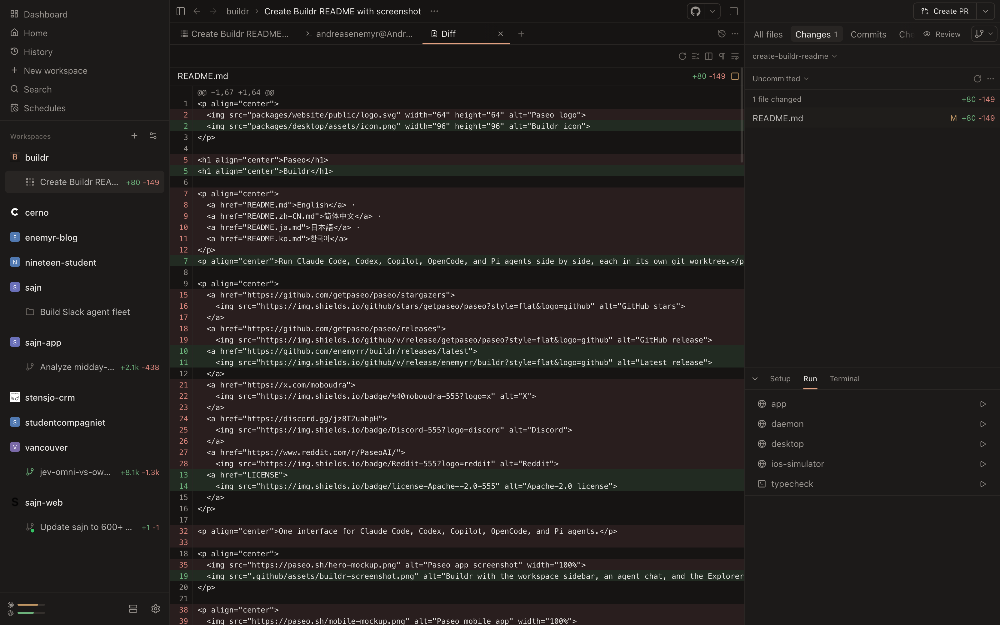

<p align="center">
  
</p>

<h1 align="center">Buildr</h1>

<p align="center">Run Claude Code, Codex, Copilot, OpenCode, and Pi agents side by side, each in its own git worktree.</p>

<p align="center">
  <a href="https://github.com/enemyrr/buildr/releases/latest">
    
  </a>
  <a href="LICENSE">
    
  </a>
</p>

<p align="center">
  
</p>

Buildr is a fork of [Paseo](https://github.com/getpaseo/paseo) with a
Conductor-style desktop app. The daemon, protocol, CLI, and mobile pairing come
from Paseo. The fork changes how you manage workspaces, pull requests, and
agents from the desktop.

## Features

- **Workspaces per branch:** Every task gets its own worktree. The sidebar shows
  each workspace's diff size, CI state, and whether an agent is busy.
- **Pull requests in the app:** The PR strip shows checks and review state, and
  lets you open, merge, and archive a pull request or continue on a new branch.
- **Explorer:** Browse all files, changes, commits, checks, and reviews.
  Start workspace scripts from the **Run** panel, and press <kbd>Cmd</kbd>+<kbd>J</kbd>
  to toggle a terminal.
- **Model loadouts:** Save a provider, model, and thinking level as a loadout
  and switch between loadouts from the composer.
- **Provider usage:** Usage bars in the sidebar show how much of each
  provider's limit you've used.
- **Per-project git settings:** Set the base branch, whether to delete the
  branch on archive, and whether to archive on merge in each project's
  `paseo.json` file or its settings screen.
- **Session import:** Import existing agent sessions into a workspace.
  Sessions started in Conductor show their Conductor workspace name.
- **Automatic tab titles:** Agent tabs get a title generated from the first
  prompt.

Everything Paseo does still works: iOS, Android, and web clients, the `paseo`
CLI, voice mode, schedules, plugins, and the end-to-end encrypted relay.

## Install

Buildr ships as a signed and notarized macOS app for Apple silicon.

1. Download the dmg file from the
   [latest release](https://github.com/enemyrr/buildr/releases/latest).
1. Drag **Buildr** to your **Applications** folder and open it.

Buildr starts its own daemon and updates itself from GitHub releases.

You need at least one agent CLI installed and signed in:

- [Claude Code](https://docs.anthropic.com/en/docs/claude-code)
- [Codex](https://github.com/openai/codex)
- [GitHub Copilot](https://github.com/features/copilot/cli/)
- [OpenCode](https://github.com/anomalyco/opencode)
- [Pi](https://pi.dev)

To connect from your phone, open **Settings > your host > Pair device** and scan
the code with the Paseo mobile app.

### Run beside Paseo

Buildr doesn't touch an installed Paseo. It uses its own bundle ID
(`se.ribban.buildr`), state directory, and daemon port. The daemon listens on
port `6777`, or the next free port above it, so Paseo keeps port `6767`.

## Development

Buildr is an npm workspace monorepo:

- `packages/server`: The daemon. It runs agents and serves the WebSocket API and
  MCP server.
- `packages/app`: The Expo client for iOS, Android, web, and desktop.
- `packages/desktop`: The Electron wrapper.
- `packages/cli`: The `paseo` CLI.
- `packages/relay`: The end-to-end encrypted relay transport.

To start the dev daemon and desktop app, run the following commands:

```bash
npm install
npm run dev
npm run dev:desktop
```

Run the checks after every change:

```bash
npm run typecheck
npm run lint
```

For setup details and conventions, see [docs/development.md](docs/development.md)
and [CLAUDE.md](CLAUDE.md).

### Build the desktop app

To build an unsigned `Buildr.app` for local use, run the following command:

```bash
scripts/build-fork-desktop.sh
```

The app is written to `packages/desktop/release/mac-arm64/Buildr.app`.

### Release

To cut a signed release on
[enemyrr/buildr](https://github.com/enemyrr/buildr/releases), run the
following command from a clean checkout of `origin/main`:

```bash
scripts/release-buildr-mac.sh patch
```

The script bumps every workspace to the same version, notarizes the dmg and zip
files, and publishes a `buildr-vVERSION` release. Installed apps update from it.
For prerequisites, see the header of
[scripts/release-buildr-mac.sh](scripts/release-buildr-mac.sh).

## Credits

Buildr builds on [Paseo](https://github.com/getpaseo/paseo) by
[Mohamed Boudra](https://github.com/boudra). The design follows
[Conductor](https://conductor.build).

## License

Apache-2.0
